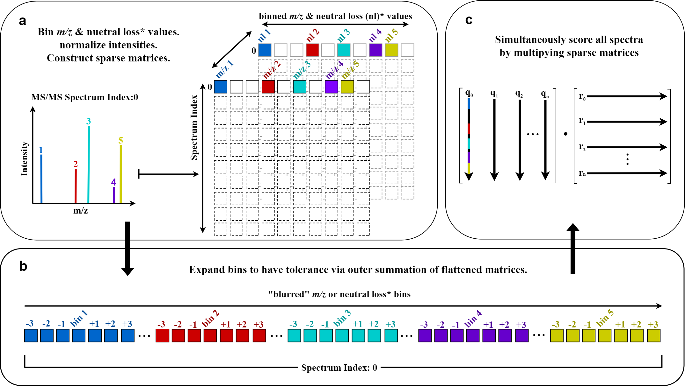

# BLINK

BLINK (Blur-and-Link) is a Python package for efficiently
generating cosine-based similarity scores and matching ion counts for large numbers of fragmentation mass spectra.   



## Installation

Use the package manager [conda](https://docs.conda.io/projects/conda/en/latest/user-guide/index.html) to install environment.yml for all BLINK and example notebook requirements.

```bash
conda env create -f environment.yml
```

[](https://mybinder.org/v2/gh/biorack/blink/HEAD)

## Base Python dependencies
- python3
- numpy
- scipy
- scikit-learn
- pandas
- matplotlib
- pyteomics
- pymzml
- networkx

## Getting Started

```
Please see for descriptions and usage of primary functions and all optional parameters 
tutorial/blink_tutorial.ipynb
```

## Command-line Usage

```
>> -m blink.blink_cli --help
usage: blink_cli.py [-h] -mds MD [MD ...] [-t TOLERANCE] [-b BIN_WIDTH] [-i INTENSITY_POWER] [--trim] [--dedup] [-s MIN_SCORE] [-m MIN_MATCHES] [-o OVERRIDE_MATCHES] [-p MIN_PREDICT] Q R O PM NM P

REM-BLINK Efficiently Performs Analog Searches Accounting For Multiple Mass Differences

positional arguments:
  Q                     MGF or mzML files containing experimental spectra
  R                     MGF or mzML files containing reference spectra
  O                     path to output file. Output file is a CSV
  PM                    path to REM-BLINK model trained for positive spectral comparisons
  NM                    path to REM-BLINK model trained for negative spectral comparisons
  P                     ion mode of query spectra. Determines the model used. Allowed inputs as "positive" and "negative"

optional arguments:
  -h, --help            show this help message and exit
  -mds MD [MD ...], --mass_diffs MD [MD ...]
                        m/z differences used to calculate score vector. Must match those used to train model (including order)

  -t TOLERANCE, --tolerance TOLERANCE
                        allowed dalton tolerance between matched MS/MS fragment peaks
  -b BIN_WIDTH, --bin_width BIN_WIDTH
                        width of bins in m/z. Larger bins will be faster at the expense of precision.
  -i INTENSITY_POWER, --intensity_power INTENSITY_POWER
                        exponent used to adjust intensities prior to scoring
  --trim                remove empty spectra when discretizing
  --dedup               deduplicate fragment ions within 2 times bin_width

  -s MIN_SCORE, --min_score MIN_SCORE
                        minimum cosine score to include in output. This should be lower than is typical since further filtering occurs after REM prediction.
  -m MIN_MATCHES, --min_matches MIN_MATCHES
                        minimum matches to include in output. This should be lower than is typical since further filtering occurs after REM prediction.
  -o OVERRIDE_MATCHES, --override_matches OVERRIDE_MATCHES
                        number of matches to keep comparison regardless of score
  -p MIN_PREDICT, --min_predict MIN_PREDICT
                        minimum REM-BLINK predicted score to include in output.
  --include_matches     include matching fragment ion counts in the output file.
```

## Command-line Example

```bash
/global/common/software/m2650/python3-matchms/bin/python -m blink.blink_cli \
 ~/repos/blink/example/accuracy_test_data/small.mgf \
 ~/repos/blink/example/accuracy_test_data/medium.mgf \
 ~/Downloads/blink2out.csv \
 /global/u2/b/bpb/repos/blink/models/positive_random_forest.pickle \
 /global/u2/b/bpb/repos/blink/models/negative_random_forest.pickle \
 positive \
 --min_predict 0.01 \
--mass_diffs 0 14.0157 12.000 15.9949 2.01565 27.9949 26.0157 18.0106 30.0106 42.0106 1.9792 17.00284 24.000 13.97925 1.00794 40.0313
```

## Pre-trained Models

```
Random forest regression models were trained using MS/MS spectra randomly sampled from a dereplicated union of GNPS, NIST17, and NIST20 spectral libraries.
For prediction to work correctly, the list of mass differences used to score spectra must be the same as the training list.

Training Lists: \
positive_random_forest: 0 14.0157 12.000 15.9949 2.01565 27.9949 26.0157 18.0106 30.0106 42.0106 1.9792 17.00284 24.000 13.97925 1.00794 40.0313 \
negative_random_forest: 0 14.0157 12.000 15.9949 2.01565 27.9949 26.0157 18.0106 30.0106 42.0106 1.9792 17.00284 24.000 13.97925 1.00794 40.0313
```

## Contributing
Pull requests are welcome.

For major changes, please open an issue first to discuss what you would like to change.
