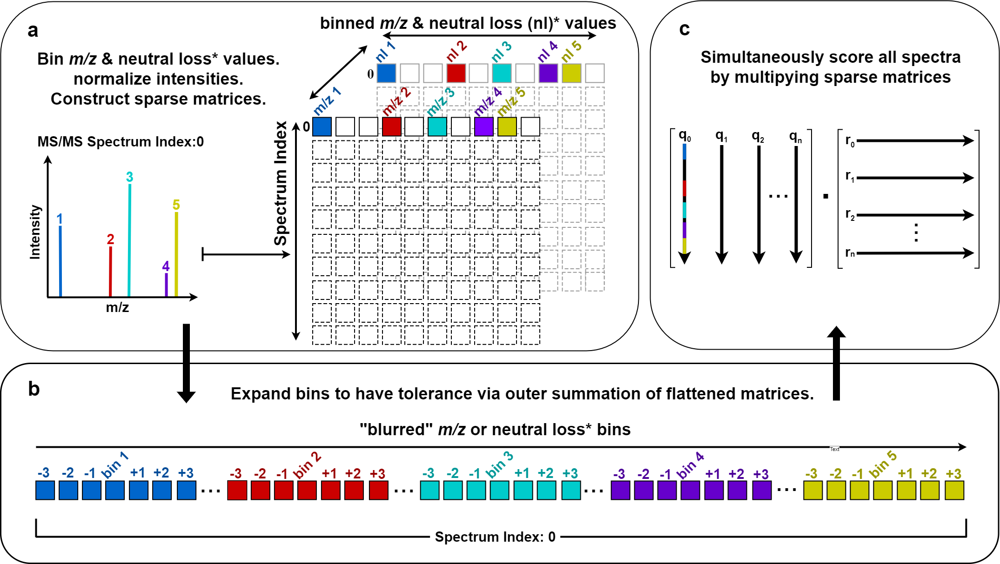

# BLINK

BLINK (Blur-and-Link) is a Python package for efficiently
generating cosine-based similarity scores and matching ion counts for large numbers of fragmentation mass spectra.   



## Installation

Use the package manager [conda](https://docs.conda.io/projects/conda/en/latest/user-guide/index.html) to install environment.yml for all BLINK and example notebook requirements.

```bash
conda env create -f environment.yml
```

[](https://mybinder.org/v2/gh/biorack/blink/HEAD)

## Base Python dependencies
- python3
- numpy
- scipy
- pandas
- pyteomics
- pymzml
- networkx

## Getting Started

```
Please see for descriptions and usage of primary functions and all optional parameters 
tutorial/blink_tutorial.ipynb
```

## Command-line Usage

```bash
>> ./blink.py --help
usage: blink.py [-h] [--trim] [--dedup] [-b B] [-i I] [-t T] [-d [D ...]] [-r R] [-s S] [-m M] [--fast_format] [-f] [-o O] F [F ...]

BLINK discretizes mass spectra (given .mgf inputs), and scores discretized spectra (given .npz inputs)

positional arguments:
  F                     files to process

optional arguments:
  -h, --help            show this help message and exit

  --trim                remove empty spectra when discretizing
  --dedup               deduplicate fragment ions within 2 times bin_width
  -b B, --bin_width B   width of bins in mz
  -i I, --intensity_power I
                        power to raise intensites to in when scoring

  -t T, --tolerance T   maximum tolerance in mz for fragment ions to match
  -d [D ...], --mass_diffs [D ...]
                        mass diffs to network
  -r R, --react_steps R
                        recursively combine mass_diffs within number of reaction steps
  -s S, --min_score S   minimum score to include in output
  -m M, --min_matches M
                        minimum matches to include in output

  --fast_format         use fast .npz format to store scores instead of .tab
  -f, --force           force file(s) to be remade if they exist
  -o O, --out_dir O     change output location for output file(s)


# Discretize fragmentation mass spectra to sparse matrix format (.npz)
# small = 1e2 spectra, medium = 1e4 spectra
>> blink.py ./example/small.mgf
small.npz
>> blink.py ./example/medium.mgf
medium.npz

# Compute all-by-all cosine scores and # matching ions for each fragmentation mass spectrum
>> blink.py ./example/small.npz
small.tab

# Compute A-vs-B cosine scores and # matching ions for each fragmentation mass spectrum
>> blink.py ./example/small.npz ./example/medium.npz
small_medium.tab
```

## Contributing
Pull requests are welcome.

For major changes, please open an issue first to discuss what you would like to change.
